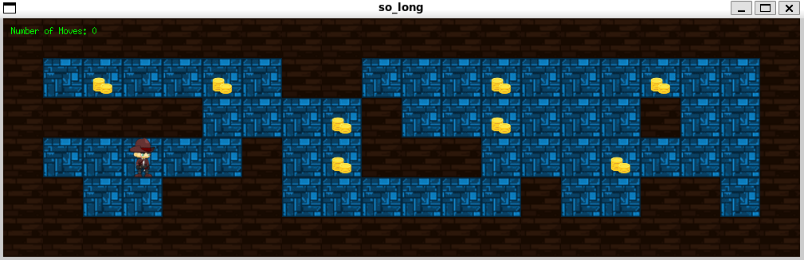
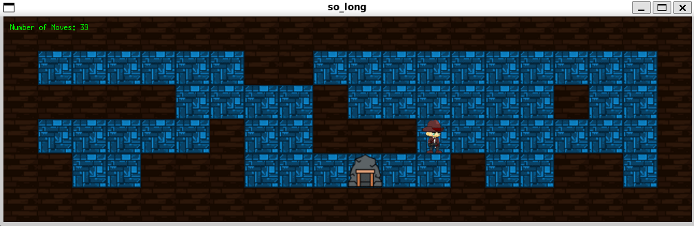

# 🎮 so_long


<p align="center">
  
</p>

---

## 📜 What is so_long?

**so_long** is a graphical project from the **42 School Cursus**, in which you build a small top-down 2D game from scratch using the **MiniLibX** graphical library. It's the first introduction to event-driven programming and rendering.

The player must navigate a map, collect all items, and reach the exit — while handling input, graphics, memory, and events.

---

## 🧰 MiniLibX (mlx) Overview

**so_long** is a 42 School project where you build a simple 2D game using **MiniLibX**, a minimal graphical library built on top of **X11** (the windowing system used by Unix-like OSes). This project introduces you to **graphical programming**, **event-driven design**, and **real-time rendering** using a C-based graphics API.

---

###  How It Works: Window Creation & Game Loop

At the core of the project is a window that you create using:

```c
void *mlx = mlx_init();
void *win = mlx_new_window(mlx, width, height, "Window Title");
```

---

### In MiniLibX, building interactive applications like `so_long` revolves around **event-driven programming**.

- **Hooking** is the mechanism that links an **event** (like a key press or mouse click) to a **callback function** you define. This function runs when the event occurs.
  
- **🎯 Events** are actions such as:
  - Pressing or releasing a key (`KeyPress`, `KeyRelease`)
  - Clicking the mouse (`ButtonPress`)
  - Moving the mouse (`MotionNotify`)
  - Exposing (refreshing) the window (`Expose`)
  - Closing the window (`DestroyNotify`)

- **🧪 Masks** define **which events your hook listens to**. For example:
  - `KeyPressMask` → `(1L << 0)`
  - `ButtonPressMask` → `(1L << 2)`
  - `ExposureMask` → `(1L << 15)`

Using `mlx_hook()`, you can control exactly what behavior happens and when. This is the core of creating a responsive game:
- Move the player with keys 🕹️  
- Cleanly exit the game when needed ❌

```c
int close_window(int keycode, void *param)
{
    (void)keycode;
    mlx_destroy_window(((t_vars *)param)->mlx, ((t_vars *)param)->win);
    exit(0);
}
mlx_hook(vars.win, 2, 1L << 0, close_window, &vars);
```

In summary:
> **Hooks + Events + Masks = Control**  
> Mastering these gives you full command over game input and behavior.

---

## 📜 Project Overview

The game consists of:
- A **map**, read from a `.ber` file.
- A **player** who can move using the keyboard (WASD).
- **Collectibles** to gather.
- An **exit**, which opens after collecting everything.

  <p align="left">
    
  </p>

Your goal is to validate the map, draw it with sprites/tiles, and implement movement, collision, and game logic.

---

## ⚙️ Requirements

- Code must follow the [Norminette](https://github.com/42School/norminette) formatting rules:
  - Max 25 lines per function
  - No forbidden keywords (e.g., `for`, `switch`, ternary `?:`)
- Must use **MiniLibX** only (no SDL, no OpenGL, etc.)
- The map file **must have a `.ber` extension**

---

## 🗺️ Map Rules

Your game map is the core of the gameplay. It must follow strict rules to be valid and playable.

### ✅ Required Format

- The map file **must have a `.ber` extension**.
- The map must be a **rectangle**: all rows must have the same length.
- The map must be **surrounded by walls** (`1`) on all sides (top, bottom, left, and right).

### 🔠 Allowed Characters

| Character | Meaning                    | Rules                       |
|-----------|----------------------------|-----------------------------|
| `1`       | Wall                       | Borders must be all `1`s    |
| `0`       | Empty/Floor                | Free space                  |
| `P`       | Player Start Position      | Must appear **once only**   |
| `C`       | Collectible                | At least **one required**   |
| `E`       | Exit                       | At least **one required**   |
| `T`       | (Bonus) Trap or Enemy      | Optional (bonus only)       |

### 🧪 Validation Rules

Your program must reject maps that:
- Are not rectangular
- Are not enclosed by walls
- Contain **invalid characters**
- Contain **more than one `P`**
- Have **no `C` or `E`**
- Are not solvable (player can't reach all collectibles and exit)

### 🗂️ Example of a Valid Map

```bash
111111
1P0C01
100001
1C0E11
111111
```

---

## 🎮 Controls

In `so_long`, the player moves around the map using the keyboard. These controls are implemented by detecting **key press events** and updating the game state accordingly.

### 🕹️ Movement Keys

| Key         | Action       |
|-------------|--------------|
| `W`         | Move Up      |
| `A`         | Move Left    |
| `S`         | Move Down    |
| `D`         | Move Right   |
| `ESC`       | Quit the game|

---

## 📦 Setup & 🚀 Run Instructions

Follow these steps in order to build and run the `so_long` project:

### 1️⃣ Clone the Repository

```bash
git clone https://github.com/yourusername/so_long.git
cd so_long
```
### 2️⃣ Compile the Project

```bash
make
```
### 3️⃣ Run the Game

```bash
./so_long ./maps/map.ber
```
